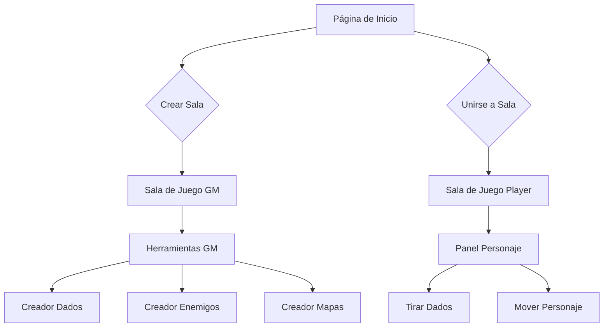

## 1. Product Overview
Plataforma web multijugador para juegos de rol Daggerheart con soporte para hasta 7 jugadores por sesión. Permite interacción en tiempo real entre dados, jugadores y el game master.

- Resuelve la necesidad de jugar Daggerheart de forma remota con herramientas integradas
- Dirigido a grupos de rol que quieran jugar Daggerheart online
- Facilita la gestión de partidas con herramientas de dados, mapas y registro de acciones

## 2. Core Features

### 2.1 User Roles
| Role | Registration Method | Core Permissions |
|------|---------------------|------------------|
| Game Master | Email registration | Crear salas, controlar todos los elementos de juego, gestionar jugadores |
| Player | Email registration | Unirse a salas, controlar su personaje, tirar dados |
| Spectator | No registration | Observar partidas (opcional) |

### 2.2 Feature Module
Nuestra plataforma Daggerheart consiste en las siguientes páginas principales:
1. **Página de inicio**: Crear sala, unirse a sala existente, selección de idioma
2. **Sala de juego**: Área central de juego, panel de personajes, chat/logs, controles del GM
3. **Creador de dados**: Herramienta para crear y personalizar dados de juego
4. **Creador de personajes**: Generador de fichas de personaje
5. **Creador de enemigos**: Herramienta para crear estadísticas de enemigos
6. **Creador de mapas**: Editor visual para crear mapas de combate y exploración

### 2.3 Page Details
| Page Name | Module Name | Feature description |
|-----------|-------------|---------------------|
| Página de inicio | Crear sala | Generar código de sala único, establecer contraseña opcional, configurar máximo de jugadores (7) |
| Página de inicio | Unirse a sala | Ingresar código de sala y contraseña, seleccionar personaje existente o crear nuevo |
| Página de inicio | Selector de idioma | Cambiar entre español e inglés en toda la aplicación |
| Sala de juego | Área central | Mostrar mapa actual, posición de personajes, efectos visuales de dados |
| Sala de juego | Panel de personajes | Lista de jugadores con vida, energía, estado de condiciones |
| Sala de juego | Chat y logs | Registro de acciones, tiradas de dados, mensajes del GM |
| Sala de juego | Controles del GM | Panel para gestionar enemigos, ambientación, eventos de historia |
| Sala de juego | Sistema de dados | Tirar dados estándar y personalizados, mostrar resultados a todos |
| Creador de dados | Editor visual | Crear dados personalizados con diferentes caras, colores y efectos |
| Creador de personajes | Ficha interactiva | Generar estadísticas, habilidades, equipo del personaje |
| Creador de enemigos | Estadísticas | Crear enemigos con vida, daño, habilidades especiales |
| Creador de mapas | Grid editor | Dibujar terrenos, colocar elementos, establecer zonas de combate |

## 3. Core Process

### Flujo de Game Master
1. GM accede a la página de inicio
2. Crea nueva sala con configuración personalizada
3. Espera a que jugadores se unan (máximo 7)
4. Accede a sala de juego con controles completos
5. Gestiona la partida usando herramientas de GM

### Flujo de Jugador
1. Jugador accede a página de inicio
2. Se une a sala existente con código y contraseña
3. Selecciona o crea personaje
4. Participa en la partida con controles limitados a su personaje
5. Interactúa con dados, mapa y otros jugadores

## 4. User Interface Design

### 4.1 Design Style
- **Colores primarios**: Marrón oscuro (#8B4513), Verde bosque (#228B22), Dorado (#DAA520)
- **Colores secundarios**: Beige (#F5DEB3), Gris piedra (#696969), Rojo oscuro (#8B0000)
- **Estilo de botones**: Bordes redondeados con efecto de piedra grabada, sombras sutiles
- **Tipografía**: MedievalSharp (Google Fonts) para títulos, Open Sans para contenido
- **Diseño general**: Tarjetas de pergamino, bordes ornamentales, iconos de estilo medieval
- **Animaciones**: Transiciones suaves, efectos de "tinte de tinta" al cambiar páginas

### 4.2 Page Design Overview
| Page Name | Module Name | UI Elements |
|-----------|-------------|-------------|
| Página de inicio | Crear sala | Formulario con fondo de pergamino, botón de piedra grabada, campo de contraseña con icono de candado |
| Página de inicio | Unirse a sala | Input de código con estilo de sello medieval, selector de personaje con miniaturas |
| Sala de juego | Área central | Grid de mapa con textura de piedra, miniaturas de personajes con bases circulares decoradas |
| Sala de juego | Panel personajes | Tarjetas de pergamino con barras de vida en rojo sangre, energía en azul mágico |
| Sala de juego | Chat/logs | Scroll de pergamino con texto en caligrafía medieval, bordes de cuero cosido |
| Creador de dados | Editor visual | Dados 3D con texturas de gemas, selector de colores con paleta medieval |

### 4.3 Responsiveness
- Diseño desktop-first con adaptación móvil
- Interfaz optimizada para tablets en modo horizontal
- Touch-friendly para dispositivos móviles con botones grandes
- Layout adaptable para diferentes resoluciones (1366x768 mínimo recomendado)

### 4.4 Estilo Visual Medieval
- **Texturas**: Papel pergamino, piedra labrada, madera oscura, cuero curtido
- **Elementos decorativos**: Cenefas de herrería, bordes de cuero con tachuelas, remaches de metal
- **Iconografía**: Espadas, escudos, calaveras, gemas, runas, plumas de ave
- **Iluminación**: Efectos de antorchas, sombras dramáticas, resplandores mágicos sutiles