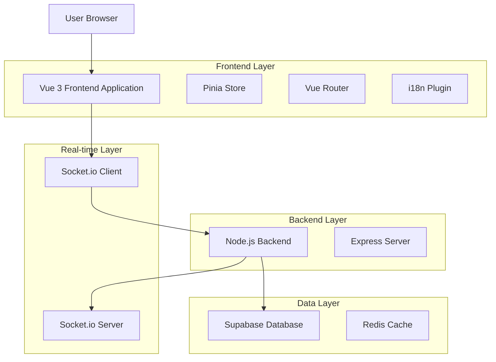
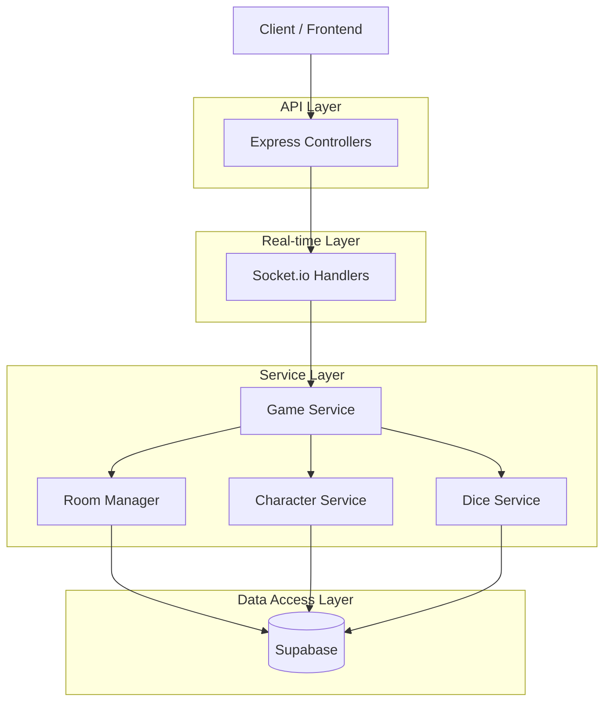
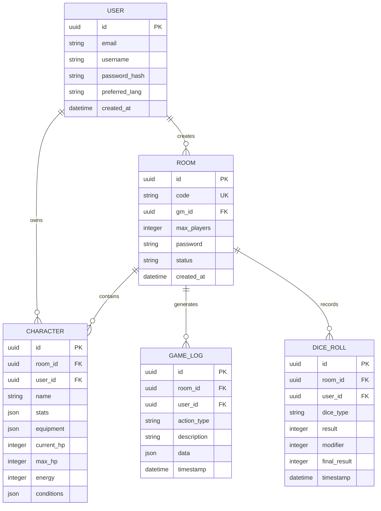

## 1. Architecture design



## 2. Technology Description

- **Frontend**: Vue 3 + Vite + Tailwind CSS + TypeScript
- **Initialization Tool**: vite-init
- **Backend**: Node.js + Express + Socket.io
- **Database**: Supabase (PostgreSQL)
- **Cache**: Redis (para sesiones de juego)
- **Real-time**: Socket.io para comunicación en tiempo real
- **i18n**: Vue i18n para soporte multiidioma (ES/EN)
- **Estado**: Pinia para gestión de estado global

## 3. Route definitions

| Route | Purpose |
|-------|---------|
| / | Página de inicio, selector de crear/unirse a sala |
| /lobby/:roomCode | Lobby de sala, esperando jugadores |
| /game/:roomCode | Sala de juego principal |
| /tools/dice | Creador de dados personalizados |
| /tools/characters | Creador de personajes |
| /tools/enemies | Creador de enemigos |
| /tools/maps | Editor de mapas |
| /profile | Perfil de usuario y configuración |

## 4. API definitions

### 4.1 Room Management

**Crear sala**
```
POST /api/rooms/create
```

Request:
| Param Name | Param Type | isRequired | Description |
|------------|-------------|-------------|-------------|
| maxPlayers | number | true | Máximo de jugadores (2-7) |
| password | string | false | Contraseña opcional |
| gmName | string | true | Nombre del Game Master |

Response:
| Param Name | Param Type | Description |
|------------|-------------|-------------|
| roomCode | string | Código único de 6 caracteres |
| status | string | Estado de la sala |

**Unirse a sala**
```
POST /api/rooms/join
```

Request:
| Param Name | Param Type | isRequired | Description |
|------------|-------------|-------------|-------------|
| roomCode | string | true | Código de la sala |
| password | string | false | Contraseña si existe |
| playerName | string | true | Nombre del jugador |

### 4.2 Game Actions

**Tirar dados**
```
POST /api/game/roll
```

Request:
| Param Name | Param Type | isRequired | Description |
|------------|-------------|-------------|-------------|
| roomCode | string | true | Código de sala |
| diceType | string | true | Tipo de dado (d4, d6, d8, etc) |
| modifier | number | false | Modificador opcional |

**Actualizar personaje**
```
POST /api/game/character/update
```

Request:
| Param Name | Param Type | isRequired | Description |
|------------|-------------|-------------|-------------|
| roomCode | string | true | Código de sala |
| characterId | string | true | ID del personaje |
| updates | object | true | Campos a actualizar |

## 5. Server architecture diagram



## 6. Data model

### 6.1 Data model definition



### 6.2 Data Definition Language

**Tabla de usuarios**
```sql
-- create table
CREATE TABLE users (
    id UUID PRIMARY KEY DEFAULT gen_random_uuid(),
    email VARCHAR(255) UNIQUE NOT NULL,
    username VARCHAR(50) UNIQUE NOT NULL,
    password_hash VARCHAR(255) NOT NULL,
    preferred_lang VARCHAR(2) DEFAULT 'es' CHECK (preferred_lang IN ('es', 'en')),
    created_at TIMESTAMP WITH TIME ZONE DEFAULT NOW()
);

-- create indexes
CREATE INDEX idx_users_email ON users(email);
CREATE INDEX idx_users_username ON users(username);
```

**Tabla de salas**
```sql
-- create table
CREATE TABLE rooms (
    id UUID PRIMARY KEY DEFAULT gen_random_uuid(),
    code VARCHAR(6) UNIQUE NOT NULL,
    gm_id UUID REFERENCES users(id),
    max_players INTEGER DEFAULT 7 CHECK (max_players BETWEEN 2 AND 7),
    password VARCHAR(255),
    status VARCHAR(20) DEFAULT 'waiting' CHECK (status IN ('waiting', 'active', 'ended')),
    created_at TIMESTAMP WITH TIME ZONE DEFAULT NOW()
);

-- create indexes
CREATE INDEX idx_rooms_code ON rooms(code);
CREATE INDEX idx_rooms_gm ON rooms(gm_id);
```

**Tabla de personajes**
```sql
-- create table
CREATE TABLE characters (
    id UUID PRIMARY KEY DEFAULT gen_random_uuid(),
    room_id UUID REFERENCES rooms(id) ON DELETE CASCADE,
    user_id UUID REFERENCES users(id),
    name VARCHAR(100) NOT NULL,
    stats JSONB DEFAULT '{}',
    equipment JSONB DEFAULT '[]',
    current_hp INTEGER DEFAULT 10,
    max_hp INTEGER DEFAULT 10,
    energy INTEGER DEFAULT 5,
    conditions JSONB DEFAULT '[]',
    created_at TIMESTAMP WITH TIME ZONE DEFAULT NOW()
);

-- create indexes
CREATE INDEX idx_characters_room ON characters(room_id);
CREATE INDEX idx_characters_user ON characters(user_id);
```

**Configuración de Supabase**
```sql
-- Permisos básicos para usuarios anónimos
GRANT SELECT ON rooms TO anon;
GRANT SELECT ON characters TO anon;

-- Permisos completos para usuarios autenticados
GRANT ALL PRIVILEGES ON users TO authenticated;
GRANT ALL PRIVILEGES ON rooms TO authenticated;
GRANT ALL PRIVILEGES ON characters TO authenticated;
GRANT ALL PRIVILEGES ON game_logs TO authenticated;
GRANT ALL PRIVILEGES ON dice_rolls TO authenticated;

-- Políticas de seguridad para RLS
ALTER TABLE rooms ENABLE ROW LEVEL SECURITY;
ALTER TABLE characters ENABLE ROW LEVEL SECURITY;

-- Política para que los usuarios puedan ver sus propias salas
CREATE POLICY "Users can view their rooms" ON rooms
    FOR SELECT USING (auth.uid() = gm_id);

-- Política para que los jugadores puedan ver personajes de su sala
CREATE POLICY "Players can view characters in their room" ON characters
    FOR SELECT USING (room_id IN (
        SELECT id FROM rooms WHERE gm_id = auth.uid() OR EXISTS (
            SELECT 1 FROM characters WHERE user_id = auth.uid()
        )
    ));
```

## 7. Estructura de carpetas del proyecto

```
daggerheart/
├── frontend/                 # Vue 3 aplicación
│   ├── src/
│   │   ├── components/        # Componentes Vue
│   │   │   ├── dice/         # Componentes de dados
│   │   │   ├── characters/   # Componentes de personajes
│   │   │   ├── maps/         # Componentes de mapas
│   │   │   └── ui/           # Componentes UI genéricos
│   │   ├── views/            # Vistas de páginas
│   │   ├── stores/           # Pinia stores
│   │   ├── router/           # Vue Router configuración
│   │   ├── i18n/             # Traducciones ES/EN
│   │   ├── assets/           # Imágenes, estilos
│   │   └── utils/            # Utilidades
│   └── public/               # Assets estáticos
├── backend/                   # Node.js servidor
│   ├── src/
│   │   ├── controllers/      # Controladores Express
│   │   ├── services/         # Lógica de negocio
│   │   ├── models/           # Modelos de datos
│   │   ├── middleware/       # Middleware Express
│   │   ├── socket/           # Socket.io handlers
│   │   └── utils/            # Utilidades
│   └── tests/                # Tests del backend
├── shared/                    # Tipos y utilidades compartidas
│   └── types/                # TypeScript interfaces
└── docs/                     # Documentación adicional
```